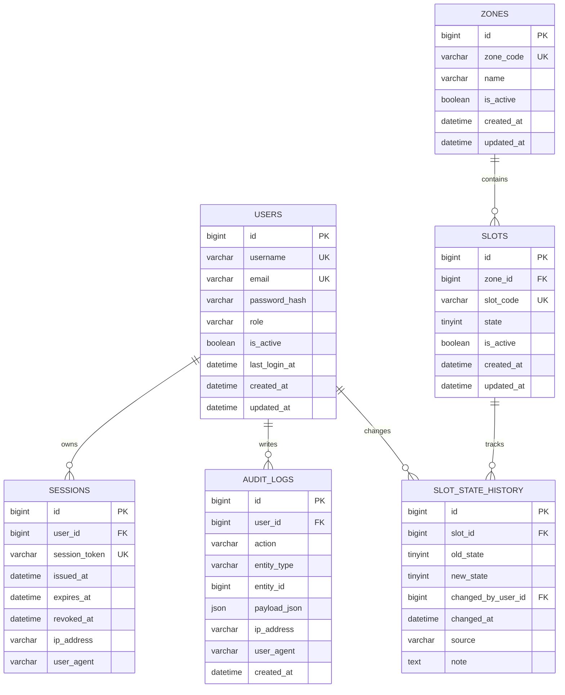

# Smart Parking System ERD

## Overview
This ERD models a production-ready Smart Parking platform with secure authentication, operational control, and auditing.

## Mermaid ERD

## Relationship Notes
- One zone has many slots.
- One slot has many state history records.
- One user can create many audit log entries.
- One user can own many active/inactive sessions.
- Slot state transitions should always append to history for traceability.

## Constraints and Validation
- `zones.zone_code` unique, uppercase format (example: `A`, `B`, `AA`).
- `slots.slot_code` unique, uppercase format (example: `A1`, `B12`).
- `slots.state` constraint: `0` available, `1` occupied, `2` maintenance.
- Foreign keys should be indexed for query performance.

## Recommended Indexes
- `users(username)` unique
- `users(email)` unique
- `zones(zone_code)` unique
- `slots(slot_code)` unique
- `slots(zone_id, state)`
- `slot_state_history(slot_id, changed_at desc)`
- `audit_logs(user_id, created_at desc)`
- `sessions(user_id, expires_at)`
